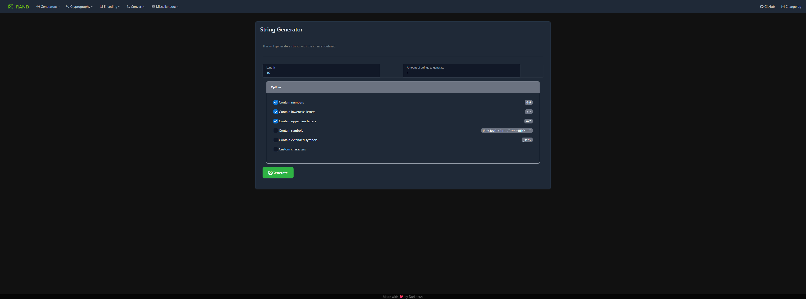

# phprand

A comprehensive collection of useful developer tools built with PHP and modern web technologies.

**Demo:** https://roste.org/rand

> [!WARNING]  
> Disclaimer: Please do not host this tool on a publicly accessible server. It most likely contains security vulnerabilities.



## Features

### Generators
- String generator
- Number generator
- Logo generator ([php-logogen](https://github.com/Darknetzz/php-logogen))
- Spin the wheel

### Encoding & Decoding
- Base converters
- Bin2Hex, Hex2Bin
- URL encoding/decoding
- HTML entities encode/decode

### Encryption & Hashing
- OpenSSL (AES encryption/decryption)
- Hashing (SHA512, SHA256, SHA1, MD5, and more)
- ROT Cipher

### Conversion & Transformation
- String tools (trim, reverse, shuffle, case conversion, etc.)
- Serialization (JSON, YAML, XML)
- Markdown editor (client-side live preview)
- Minify (CSS and JavaScript)
- Metaphone (phonetic key generation)

### Networking
- DNS lookup (hostname/IP resolution)
- CIDR to IP range
- IP range to CIDR conversion
- Subnet mask calculator
- IP to hexadecimal converter

### Comparison & Analysis
- Levenshtein distance (with tunable costs)
- Diff viewer (pure PHP, colorized output)

### Miscellaneous
- Calculator (basic arithmetic)
- Currency converter
- Datetime tools (time unit conversion, timezone selector)

## Installation

### Docker (Recommended)

#### Pull from Docker Hub
```bash
# Pull latest image
docker pull darknetz/php-rand:latest

# Run container (replace 12345 with your desired port)
docker run -d -p 12345:80 --name php-rand darknetz/php-rand:latest
```

#### Docker Compose
```yaml
services:
  phprand:
    image: darknetz/php-rand:latest
    container_name: php-rand
    ports:
      - "12345:80"  # replace 12345 with your desired port
    restart: unless-stopped
```

#### Build from Dockerfile
```bash
# Clone repo
git clone --recurse-submodules https://github.com/Darknetzz/php-rand.git && cd php-rand

# Build image
docker build --no-cache -t php-rand .

# Run container (replace 12345 with your desired port)
docker run -d -p 12345:80 --name php-rand php-rand
```

### Manual Installation (Without Docker)

Requirements:
- PHP 8.3+ with extensions: mbstring, mcrypt, gd, yaml, xml
- Web server (Apache, Nginx, etc.) with PHP support
- Composer (for dependency management)

```bash
# Install system dependencies (Ubuntu/Debian)
sudo apt install -y php8.3-common php8.3-mbstring php8.3-mcrypt php8.3-gd php8.3-yaml php8.3-xml

# Clone repository (assuming webroot is /var/www/html)
cd /var/www/html
git clone --recurse-submodules https://github.com/Darknetzz/php-rand.git
cd php-rand

# Install Composer dependencies
composer install
```

Open your browser and visit `http://<webserver>/php-rand`

## Documentation

For detailed documentation, feature guides, and implementation details, see:
- [CHANGELOG](docs/CHANGELOG.md) - Version history and feature updates
- [README](docs/README.md) - Detailed feature documentation
- [IMPLEMENTATION_SUMMARY](docs/IMPLEMENTATION_SUMMARY.md) - Technical implementation details
- [VISUAL_GUIDE](docs/VISUAL_GUIDE.md) - UI/UX design documentation
- [RANDOM_BUTTON_FEATURE](docs/RANDOM_BUTTON_FEATURE.md) - Random data generation feature guide

## Key Features

### 🎲 Smart Random Data Generation
Automatic random data buttons for all input fields with context-aware detection:
- Calculator inputs get math expressions
- Networking fields get IP addresses or CIDR notation
- Email fields get email addresses
- And 20+ other context-specific generators

### 🌍 UTF-8 Support
Full UTF-8 character encoding support across all modules for international text handling.

### 📚 Comprehensive Documentation
All functions include PHPDoc comments with descriptions, parameters, return types, and usage examples.

### 🎨 Modern UI/UX
- Dark theme with gradient accents
- Responsive Bootstrap-based layout
- Split input/output designs
- Smooth animations and visual feedback
- Copy-to-clipboard functionality

## Architecture

- **Backend:** PHP 8.3+ with modular design
- **Frontend:** Vanilla JavaScript, jQuery, Bootstrap 5, Tabler UI
- **Dependencies:** Composer-managed (minify utilities, submodules)
- **Extensible:** Easy to add new tools by creating new modules

## License

See LICENSE file in the repository.

## Support

For bugs, feature requests, or questions, please visit the [GitHub repository](https://github.com/Darknetzz/php-rand).
