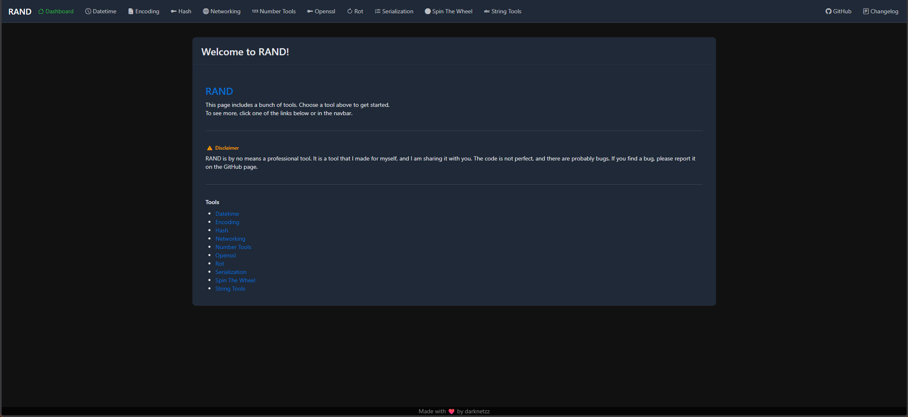

# phprand

A set of useful tools for developers.



# features
* Generators
  * String generator
  * Number generator
  * Logo generator ([php-logogen](https://github.com/Darknetzz/php-logogen))
  * Spin the wheel
* Encoding / Decoding
  * Base converters
  * Bin2Hex, Hex2Bin
  * URL encoding/decoding
  * HTML entities encode/decode
* Encryption / Decryption
  * OpenSSL
  * Hashing (SHA512, SHA256, SHA1, MD5)
  * ROT Cipher
* Networking
  * CIDR to range
  * Range to CIDR
  * Subnet mask
  * IP2Hex, Hex2IP
* Misc.
  * String tools - trim, reverse, shuffle, convert etc.
  * Serialization (JSON, YAML, XML)
  * Datetime tools
  * Calculator

# install
Simply clone the repo and put it on your webserver with PHP support.

```bash
# install dependencies
sudo apt install -y php8.3-common php8.3-mbstring php8.3-mcrypt php8.3-gd php8.3-mcrypt php8.3-yaml php8.3-xml

# Assuming your webroot is located in `/var/www/html`
cd /var/www/html

# Clone the repo
git clone --recurse-submodules https://github.com/Darknetzz/php-rand.git
```

Open a webbrowser and visit `http://<webserver>/php-rand`

# demo
* demo @ https://roste.org/rand
