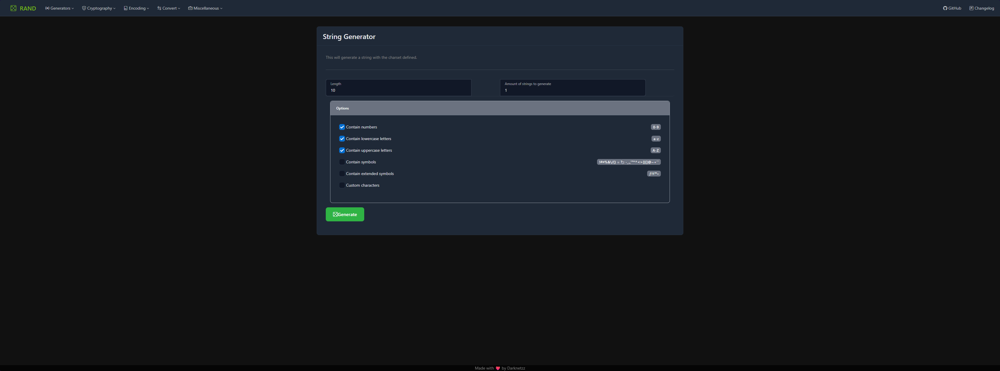

# phprand

A comprehensive collection of useful developer tools built with PHP and modern web technologies.

**Demo:** [https://roste.org/rand](https://rand.demo.roste.org/)

> [!WARNING]  
> Disclaimer: Please do not host this tool on a publicly accessible server. It most likely contains security vulnerabilities.



## Features

### Generators
- String generator
- Number generator
- QR Code generator
- Logo generator (built into this repository)
- Spin the wheel

### Encoding & Decoding
- Base converters
- Bin2Hex, Hex2Bin
- URL encoding/decoding
- HTML entities encode/decode

### Encryption & Hashing
- OpenSSL (AES encryption/decryption)
- Hashing (SHA512, SHA256, SHA1, MD5, and more)
- ROT Cipher

### Conversion & Transformation
- String tools (trim, reverse, shuffle, case conversion, etc.)
- Serialization (JSON, YAML, XML)
- Markdown editor (client-side live preview)
- Minify (CSS and JavaScript)
- Metaphone (phonetic key generation)
- Unit converter (Convert → Units: volume, length, weight, temperature, energy, area, speed, time, power, data, pressure, angle)
- Currency converter (Convert → Currency Converter)

### Networking
- DNS lookup (hostname/IP resolution)
- CIDR to IP range
- IP range to CIDR conversion
- Subnet mask calculator
- IP to hexadecimal converter

### Comparison & Analysis
- Levenshtein distance (with tunable costs)
- Diff viewer (pure PHP, colorized output)

### Miscellaneous
- Calculator (basic arithmetic)
- Datetime tools (time unit conversion, timezone selector)

## Installation

### Docker (Recommended)

The published image and `Dockerfile` use **PHP 8.5** with **GMP**, **OpenSSH client** (`ssh-keygen`), and the extensions listed in the Dockerfile.

#### Pull from Docker Hub
```bash
# Pull latest image
docker pull darknetz/php-rand:latest

# Run container (replace 12345 with your desired port)
docker run -d -p 12345:80 --name php-rand darknetz/php-rand:latest
```

#### Docker Compose
```yaml
services:
  phprand:
    image: darknetz/php-rand:latest
    container_name: php-rand
    ports:
      - "12345:80"  # replace 12345 with your desired port
    restart: unless-stopped
```

#### Build from Dockerfile
```bash
# Clone repo
git clone https://github.com/Darknetzz/php-rand.git && cd php-rand

# Build image
docker build --no-cache -t php-rand .

# Run container (replace 12345 with your desired port)
docker run -d -p 12345:80 --name php-rand php-rand
```

### Manual Installation (Without Docker)

Requirements:
- PHP 8.3+ with extensions: mbstring, mcrypt, gd, yaml, xml, gmp
- Web server (Apache, Nginx, etc.) with PHP support
- Composer (for dependency management)

```bash
# Install system dependencies (Ubuntu/Debian)
sudo apt install -y php8.3-common php8.3-mbstring php8.3-mcrypt php8.3-gd php8.3-yaml php8.3-xml php8.3-gmp

# Clone repository (assuming webroot is /var/www/html)
cd /var/www/html
git clone https://github.com/Darknetzz/php-rand.git
cd php-rand

# Install Composer dependencies
composer install
```

Open your browser and visit `http://<webserver>/php-rand`

## Production Performance Guidance

For production deployments, enable HTTP compression and strong cache headers for static assets.

### Nginx (gzip + brotli + cache headers)

```nginx
# Compression
gzip on;
gzip_comp_level 5;
gzip_min_length 1024;
gzip_vary on;
gzip_proxied any;
gzip_types text/plain text/css application/javascript application/json application/xml image/svg+xml;

# If ngx_brotli is installed:
brotli on;
brotli_comp_level 5;
brotli_types text/plain text/css application/javascript application/json application/xml image/svg+xml;

# Static assets: long cache
location ~* \.(?:css|js|png|jpg|jpeg|gif|svg|webp|ico|woff2?)$ {
    expires 30d;
    add_header Cache-Control "public, max-age=2592000, immutable";
}

# HTML/PHP responses: short/no cache
location ~* \.(?:html|php)$ {
    add_header Cache-Control "no-cache, must-revalidate";
}
```

### Apache (.htaccess or vhost)

```apache
<IfModule mod_deflate.c>
  AddOutputFilterByType DEFLATE text/plain text/html text/css application/javascript application/json application/xml image/svg+xml
</IfModule>

<IfModule mod_brotli.c>
  AddOutputFilterByType BROTLI_COMPRESS text/plain text/html text/css application/javascript application/json application/xml image/svg+xml
</IfModule>

<IfModule mod_expires.c>
  ExpiresActive On
  ExpiresByType text/css "access plus 30 days"
  ExpiresByType application/javascript "access plus 30 days"
  ExpiresByType image/png "access plus 30 days"
  ExpiresByType image/jpeg "access plus 30 days"
  ExpiresByType image/svg+xml "access plus 30 days"
</IfModule>

<IfModule mod_headers.c>
  <FilesMatch "\.(css|js|png|jpg|jpeg|gif|svg|webp|ico|woff|woff2)$">
    Header set Cache-Control "public, max-age=2592000, immutable"
  </FilesMatch>
  <FilesMatch "\.(php|html)$">
    Header set Cache-Control "no-cache, must-revalidate"
  </FilesMatch>
</IfModule>
```

Notes:
- Use content-hashed filenames (`app.abc123.js`) for truly immutable caching.
- Keep HTML dynamic/short-lived so new releases are discovered quickly.

## Documentation

For detailed documentation, feature guides, and implementation details, see:
- [CHANGELOG](docs/CHANGELOG.md) - Version history and feature updates
- [README](docs/README.md) - Detailed feature documentation
- [IMPLEMENTATION_SUMMARY](docs/IMPLEMENTATION_SUMMARY.md) - Technical implementation details
- [VISUAL_GUIDE](docs/VISUAL_GUIDE.md) - UI/UX design documentation
- [RANDOM_BUTTON_FEATURE](docs/RANDOM_BUTTON_FEATURE.md) - Random data generation feature guide

## Release Workflow

Use the interactive release helper:

```bash
./scripts/release.sh 1.2.10
```

What it does:
- rotates `CHANGELOG.md` from `## [Unreleased]` into `## [vX.Y.Z] (YYYY-MM-DD)`
- recreates a fresh `Unreleased` template
- sets `VERSION=vX.Y.Z` in `docker-image.config` so local Docker builds match the release
- creates a release commit and annotated tag (`vX.Y.Z`; commit includes `CHANGELOG.md` and `docker-image.config`)
- optionally pushes branch + tag after an explicit confirmation prompt
- **GitHub Release + Docker Hub / GHCR images:** pushing the tag runs `.github/workflows/release.yml` and `docker-release.yml`. You normally do **not** need `gh` or `docker-pushimage.sh` unless Actions are off or you want an immediate local registry push.
- after a successful push, prompts (from `/dev/tty`, not stdin) to run `gh release create` and `./docker-pushimage.sh` — default is **Y** (Enter accepts) so a normal push is not cut short after `git`
- then prompts to **merge `dev` into `main` and push** (default **Y**) so the default branch matches the release line; override branch names with `RELEASE_BRANCH` / `MAIN_BRANCH` if needed
- if you already pushed the tag but skipped those steps: `./scripts/release.sh 1.2.10 --publish-only` (includes the same `gh`, Docker, and merge prompts when run from `dev`)

**Why GitHub might still show an older “Latest” release:** the badge uses **GitHub Releases**, not tags only. You need either a successful `release.yml` run on tag push or `gh release create`. If that step failed earlier, create the release with `--publish-only` or from the Releases UI.

Environment toggles:
- `CREATE_GH_RELEASE=1` — after push, run `gh release create` with changelog notes (skipped if the release already exists, e.g. CI created it first)
- `PUBLISH_DOCKER=1` — after push, run `./docker-pushimage.sh` (uses updated `docker-image.config`; still uses your Docker Hub / `.env` credentials)
- `MERGE_RELEASE_TO_MAIN=1` — after the above, merge `dev` into `main` and push (non-interactive; combine with other toggles as needed)

Common options:
- `./scripts/release.sh --help` to show usage
- `./scripts/release.sh 1.2.10 --dry-run` to preview actions only
- `./scripts/release.sh 1.2.10 --publish-only` to run only `gh` + Docker after the tag is on the remote
- `./scripts/extract_changelog_section.sh --help` to show extraction script usage

CI Docker publish requirements:
- Docker Hub secrets: `DOCKERHUB_USERNAME` and `DOCKERHUB_TOKEN`
- GHCR publish uses `GITHUB_TOKEN` automatically

## Key Features

### Number Generator Notes

- Digit mode supports up to 50 digits.
- For values above the native PHP integer range on the current server, generation uses **GMP** (including `gmp_prob_prime` for primality). Supported large-digit types include `any`, `odd`, `even`, `palindromic`, `prime`, and `composite`.
- `square` and `fibonacci` still require native integer ranges and are not available for digit ranges above that limit.

### 🎲 Smart Random Data Generation
Automatic random data buttons for all input fields with context-aware detection:
- Calculator inputs get math expressions
- Networking fields get IP addresses or CIDR notation
- Email fields get email addresses
- And 20+ other context-specific generators

### 🌍 UTF-8 Support
Full UTF-8 character encoding support across all modules for international text handling.

### 📚 Comprehensive Documentation
All functions include PHPDoc comments with descriptions, parameters, return types, and usage examples.

### 🎨 Modern UI/UX
- Dark theme with gradient accents
- Responsive Bootstrap-based layout
- Split input/output designs
- Smooth animations and visual feedback
- Copy-to-clipboard functionality

## Architecture

- **Backend:** PHP 8.3+ with modular design (Docker image: PHP 8.5)
- **Frontend:** Vanilla JavaScript, jQuery, Bootstrap 5, Tabler UI
- **Dependencies:** Composer-managed (minify utilities)
- **Extensible:** Easy to add new tools by creating new modules

## License

See LICENSE file in the repository.

## Support

For bugs, feature requests, or questions, please visit the [GitHub repository](https://github.com/Darknetzz/php-rand).
